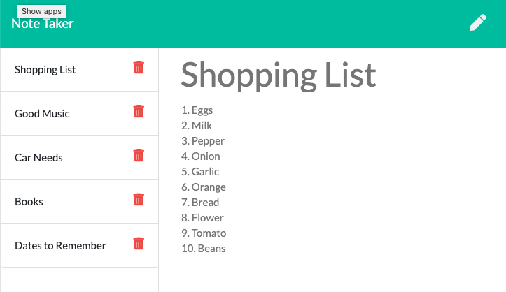

## Note Taker 
  
  ****
  

  [Go to deployed website ====>](https://dry-harbor-34594.herokuapp.com/notes "Note Taker App")

  ### Description
  This project is a server side note taking app that will be able to create, store, and delete notes that the user provides. It is an express server based application that will store note data and display it to the user through the page url found [here](https://dry-harbor-34594.herokuapp.com/notes "Note Taker App") 
  ### Table of Contents
  [Installation](#Installation)
  [Usage](#Usage)
  [Licence](#Licence)
  [Contributing](#Contributing)
  [Tests](#Tests)
  [Questions](#Questions)
  [Project Status](#Project-status)
  
  ### Installation
  If you are planning to run this code as a node module you will first need to install the required dependencies using the code snippet below:
  ```
 npm -i 
```
  ### Usage
  This app is simple to run and is set up to use port 8080 for local running. Start the program with the code snippet below:
  ```
node server.js 
```

  ### License 
  
  ### Contributing
  George Gombert - Back end development n\
  UofU Dev Program - Front end styling
  
  ### Questions or Issues
  If you have any questions or have found issues with the program, please reach out to George
   [Email](georgegombert@gmail.com)
  ### Project Status
  Project fully operational and deployed. Plans for the future include making multiple accounts to take notes on for different individuals. Plans also include na edit feature on the notes.